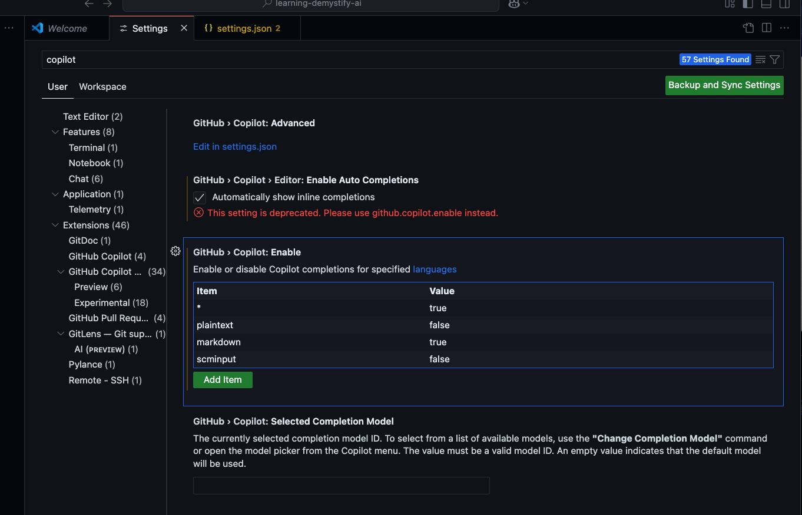
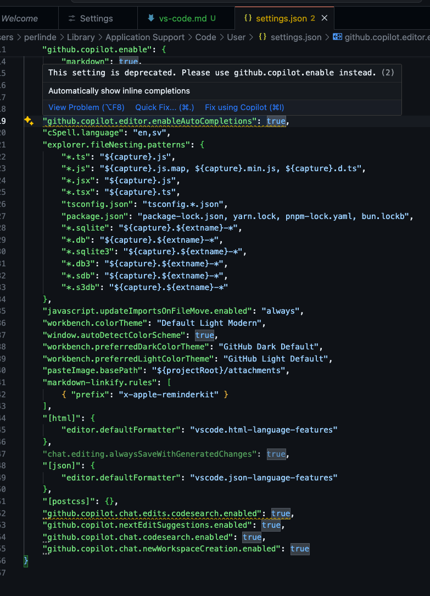

## Gotchas

- Be aware, there might be great features that needs to be enabled in settings:
  - For example, the `github.copilot.nextEditSuggestions.enabled` setting enable Copilot to suggest next edit
- Extensions are evolving. The settings you used yesterday may not work today:
   - You can review the JSON to identify and mitigate config issues.
  
-
